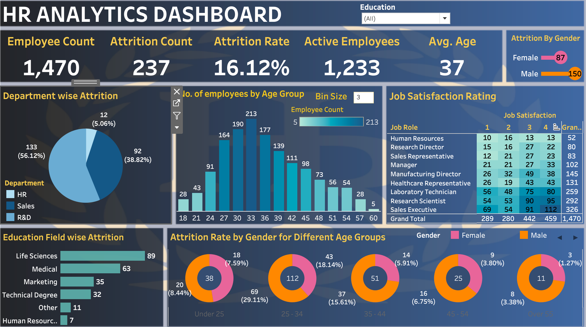

# 📊 HR Analytics Dashboard

This project is an **interactive HR Analytics Dashboard** built using **Tableau**. It provides insights into employee attrition, demographics, job satisfaction, and department-wise workforce distribution.  
The dashboard helps HR teams and decision-makers identify trends, analyze attrition causes, and make data-driven workforce strategies.  

---

## 🚀 Features

- **Employee Overview** – Total employees, attrition count, attrition rate, active employees, and average age  
- **Department-wise Attrition** – Pie chart breakdown of attrition across HR, Sales, and R&D  
- **Age Group Distribution** – Histogram showing employee count by age brackets  
- **Attrition by Gender & Age Groups** – Donut charts comparing male vs female attrition  
- **Education Field-wise Attrition** – Bar chart for attrition across education backgrounds  
- **Job Satisfaction Rating** – Heatmap of job satisfaction across different roles  

---

## 🛠️ Tools & Technologies

- Tableau – Dashboard creation & visualization  
- Excel / CSV Dataset – Data source (employee attrition dataset)   

---

## 📸 Dashboard Preview  

---

## 🔍 Insights

- Overall attrition rate is **16.12%**  
- **Sales Department** has the highest attrition (**56.12%**)  
- Attrition is higher among **males (150)** compared to females (87)  
- Employees aged **25–34** show the maximum attrition  
- Sales Executives report higher attrition despite moderate satisfaction ratings  

---

## 📈 Use Cases

- Identify **high-risk attrition groups**  
- Support **data-driven workforce planning**  
- Provide visibility into **employee satisfaction trends**  
- Useful for **retention strategies & HR policy making**  
